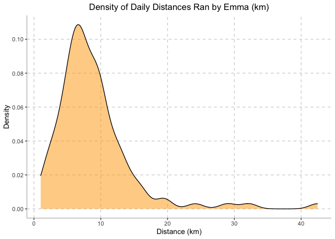
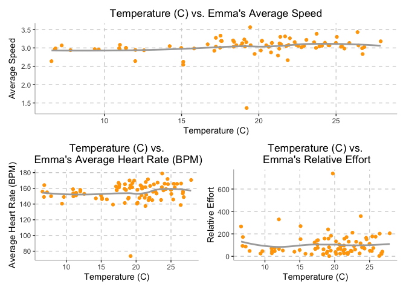
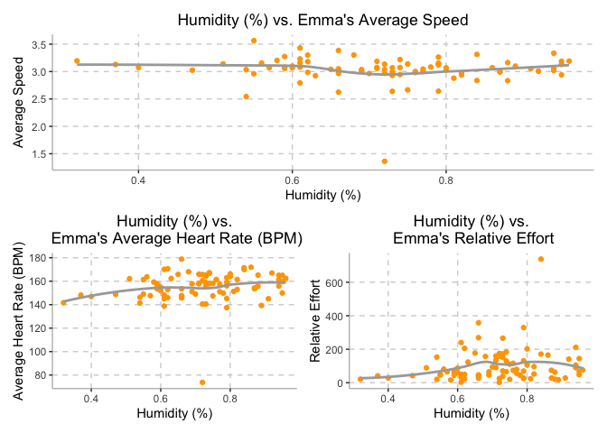

An In-Depth Analysis of Emma Sexton’s 2022 NYC Marathon Training
================
Gwyneth Wei (gw2442); Emma Sexton (els2250); Olivia Wang (hw2852);
Mayuri Albal (ma4197) <br>
10 December 2022

#### Motivation: Provide an overview of the project goals and motivation.

<br/>

#### Related Work: Anything that inspired you, such as a paper, a web site, or something we discussed in class.

<br/>

#### Initial Questions: What questions are you trying to answer? How did these questions evolve over the course of the project? What new questions did you consider in the course of your analysis?

<br/>

#### Data: Source, scraping method, cleaning, etc.

Data was collected using the Garmin Forerunner 245 activity watch from
August 17, 2020 to November 6, 2022. Collected data was uploaded to
Strava.com after each activity. After granting permission, personal data
was downloaded from Strava.com. Each activity logged by the Garmin watch
was downloaded as a separate FIT file; therefore, using the `FITfileR`
package, data was imported into R.

##### *Importing Data*

First, we imported the summary data of all of Emma’s training runs from
July 23, 2020…

``` r
library(tidyverse)
```

    ## ── Attaching packages ─────────────────────────────────────── tidyverse 1.3.2 ──
    ## ✔ ggplot2 3.4.0      ✔ purrr   0.3.5 
    ## ✔ tibble  3.1.8      ✔ dplyr   1.0.10
    ## ✔ tidyr   1.2.1      ✔ stringr 1.5.0 
    ## ✔ readr   2.1.3      ✔ forcats 0.5.2 
    ## ── Conflicts ────────────────────────────────────────── tidyverse_conflicts() ──
    ## ✖ dplyr::filter() masks stats::filter()
    ## ✖ dplyr::lag()    masks stats::lag()

``` r
library(FITfileR)
library(dplyr)
library(patchwork)
```

``` r
training_summary <- read_csv("activities/activities.csv") %>% 
  janitor::clean_names() %>%
  filter(activity_type == "Run") %>%
  select(activity_id, activity_date, activity_name, activity_description, elapsed_time_6, distance_7, max_heart_rate_8, relative_effort_9, max_speed, average_speed, elevation_gain, elevation_loss, max_grade, average_grade, max_cadence, average_cadence, average_heart_rate, calories, weather_temperature, dewpoint, humidity, wind_speed) %>%
  filter(activity_id >= 6910869137) %>%
  separate(activity_date, c("month_date", "year", "time"), sep = ", ") %>%
  mutate(
    date = str_c(month_date, year, sep = " "),
    date = as.Date(date, format = "%b%d%Y")
  ) %>%
  select(-month_date, -year) %>%
  mutate(
    elapsed_time_min = elapsed_time_6 / 60,
    distance_km = distance_7,
    max_heart_rate = max_heart_rate_8,
    relative_effort = relative_effort_9
  ) %>%
  select(-elapsed_time_6, -distance_7, -max_heart_rate_8, -relative_effort_9)
```

    ## New names:
    ## Rows: 335 Columns: 84
    ## ── Column specification
    ## ──────────────────────────────────────────────────────── Delimiter: "," chr
    ## (6): Activity Date, Activity Name, Activity Type, Activity Description,... dbl
    ## (49): Activity ID, Elapsed Time...6, Distance...7, Max Heart Rate...8, R... lgl
    ## (29): Commute...10, Athlete Weight, Bike Weight, Average Positive Grade,...
    ## ℹ Use `spec()` to retrieve the full column specification for this data. ℹ
    ## Specify the column types or set `show_col_types = FALSE` to quiet this message.
    ## • `Elapsed Time` -> `Elapsed Time...6`
    ## • `Distance` -> `Distance...7`
    ## • `Max Heart Rate` -> `Max Heart Rate...8`
    ## • `Relative Effort` -> `Relative Effort...9`
    ## • `Commute` -> `Commute...10`
    ## • `Elapsed Time` -> `Elapsed Time...15`
    ## • `Distance` -> `Distance...17`
    ## • `Max Heart Rate` -> `Max Heart Rate...30`
    ## • `Relative Effort` -> `Relative Effort...37`
    ## • `Commute` -> `Commute...50`

``` r
activity_summaries =
  training_summary %>%
  select(activity_id, date, time, activity_name, activity_description)

tidy_training = 
  training_summary %>%
  select(-activity_name, -activity_description) %>%
  select(activity_id, date, time, distance_km, elapsed_time_min, max_speed, average_speed, max_heart_rate, average_heart_rate, relative_effort, everything()) %>% 
  filter(date != "2022-03-31", 
         date != "2022-04-03")
```

Since each Garmin activity was downloaded as an individual FIT file, a
function was created to iterate across the multiple activities and
compile a single data frame. As shown below, the function was created to
read each activity FIT file into R and pull out the records (which
included data on latitude and longitude, distance, speed, heart rate,
and cadence), and then each second of activity was merged into a single
data frame. This function was applied to a list of all file names. A
`for` loop was used to generate a list of data frames, and then rows
were merged using `bind_rows` to create the final data frame,
`marathon_df`.

##### *Data Cleaning*

After importing, the data frame was then cleaned to include activities
from the start of marathon training (March 31, 2022) to the day of the
New York City Marathon (November 6, 2022). Within the ‘activities’ data
set, there were 335 observations and 84 variables. The data was filtered
to only include observations from ‘activity_type’ that were classified
as ‘Run’. From this, 22 variables were selected to be included in this
data set: activity_id, activity_date, activity_name,
activity_description, elapsed_time_6, distance_7, max_heart_rate_8,
relative_effort_9, max_speed, average_speed, elevation_gain,
elevation_loss, max_grade, average_grade, max_cadence, average_cadence,
average_heart_rate, calories, weather_temperature, dewpoint,
humidity,and wind_speed.

Due to Emma’s marathon training beginning March 31st, 2022, the
‘activity_id’ was used in order to filter any training prior to this.
Following this, the variable ‘activity_date’ was separated into two
variables:the date on which the run occurred (‘date’) as well as the
time when the run began (‘time’). The ‘elapsed_time_6’ variable was
converted from seconds to minutes (‘elapsed_time_min’). In addition to
this, the variables names for distance_7, max_heart_rate_8, and
relative_effort_9 were changed to distance_km, max_heart_rate, and
relative_effort.

A new data frame, ‘activities_summaries’ was created in order to include
the written accounts from each of Emma’s runs, including variables
‘activity_name’ and ‘activity_description’.

The final cleaned data set, ‘tidy_training’, included 110 observations
and 21 variables. Variables included were:activity_id, date, time,
distance_km, elapsed_time_min, max_speed, average_speed, max_heart_rate,
average_heart_rate, relative_effort, elevation_gain, elevation_loss,
max_grade, average_grade, max_cadence, averag_cadence, calories,
weather_temperature, dewpoint, humidity, and wind_speed.

``` r
# data_import <- function(list_data) {
# 
#   garmin_data <- readFitFile(list_data)
# 
#   garmin_activities_df <- records(garmin_data) %>%
#     bind_rows() %>%
#     arrange(timestamp)
# 
#   garmin_activities_df
# 
# }
# 
# garmin_fitfiles <- "activities/fit_files/garmin_data_"
# 
# list_of_fitfiles <- str_c(garmin_fitfiles, c("1":"329"), ".fit")
# 
# n = 329
# datalist = list()
# datalist = vector("list", length = n)
# 
# for (i in 1:n) {
#   datalist[[i]] <- data_import(list_of_fitfiles[i])
# }
# 
# marathon_df <- bind_rows(datalist)
```

##### *Data Cleaning*

After importing, the data frame was then cleaned to include activities
from the start of marathon training (March 31, 2022) to the day of the
New York City Marathon (November 6, 2022). Data were…

Other decisions we need to make:

\[ \] Need to decide if we want to keep each observation as a single
second for each activity

\[ \] Need to decide if we want to focus solely on training runs or
include walks and other activities (elliptical or biking)

<br/>

#### Exploratory Analysis: Visualizations, summaries, and exploratory statistical analyses. Justify the steps you took, and show any major changes to your ideas.

- Mileage over time (Intro) - Individual monthly or weekly mileage
- Rounded mileage to closest mile, density plot of how many times you
  ran a certain mileage or violin
- Temperature vs average speed/average heart rate/relative effort (all
  of these) – \* Elevation vs average speed/relative effort
- Mapping running trails (plotly/gis(?)) - only marathon route, map
  cadence/heart rate
- Predict mph in marathon using temperature, humidity, relative effort,
  etc.

Side note: Rest days are not in strava data - create data set with all
dates. we make a variable that is yes/no for rest days.

#### Mileage over time

``` r
tidy_training = tidy_training %>% 
  mutate(week = as.numeric(strftime(date, format = "%V")) - 13) %>% 
  group_by(week) %>%
  mutate(weekly_distance_km = sum(distance_km))

tidy_training %>%
  ggplot(aes(x = week, y = weekly_distance_km)) +
  geom_point(color = c("#FFA500")) +
  geom_line(color = c("#FFA500")) + 
  labs(
    title = "Weekly Distance Ran by Emma (km)",
    x = "Week", 
    y = "Distance (km)") + 
  scale_x_continuous(breaks = scales::pretty_breaks(n = 5)) + 
  scale_y_continuous(breaks = scales::pretty_breaks(n = 5)) +
  theme(axis.line = element_line(color = "grey"), 
        panel.background = element_blank(), 
        legend.position = "none", 
        panel.grid.major = element_line(color = "light grey", linetype = "dashed"),
        plot.title = element_text(hjust = 0.5))
```

<!-- -->

#### Mileage Density Plot

``` r
tidy_training %>% 
  ggplot(aes(x = distance_km), color = c("#FFA500")) +
  geom_density(alpha = 0.5, fill = c("#FFA500")) + 
  labs(
    title = "Density of Daily Distances Ran by Emma (km)",
    x = "Distance (km)", 
    y = "Density") + 
  scale_x_continuous(breaks = scales::pretty_breaks(n = 5)) + 
  scale_y_continuous(breaks = scales::pretty_breaks(n = 5)) +
  theme(axis.line = element_line(color = "grey"), 
        panel.background = element_blank(), 
        legend.position = "none", 
        panel.grid.major = element_line(color = "light grey", linetype = "dashed"),
        plot.title = element_text(hjust = 0.5))
```

<!-- -->

#### Choose Your Graph (Drop down list of Y and X)

Temperature vs average speed/average heart rate/relative effort (all of
these)

##### Temperature vs. Average Speed

``` r
tidy_training %>% 
  ggplot(aes(x = weather_temperature, y = average_speed)) + 
  geom_point(color = c("#FFA500")) +
  geom_smooth(se = FALSE, color = "dark grey") + 
    labs(
    title = "Temperature (C) vs. Emma's Average Speed",
    x = "Temperature (C)", 
    y = "Average Speed") + 
  scale_x_continuous(breaks = scales::pretty_breaks(n = 5)) + 
  scale_y_continuous(breaks = scales::pretty_breaks(n = 5)) +
  theme(axis.line = element_line(color = "grey"), 
        panel.background = element_blank(), 
        legend.position = "none", 
        panel.grid.major = element_line(color = "light grey", linetype = "dashed"),
        plot.title = element_text(hjust = 0.5))
```

    ## `geom_smooth()` using method = 'loess' and formula = 'y ~ x'

    ## Warning: Removed 23 rows containing non-finite values (`stat_smooth()`).

    ## Warning: Removed 23 rows containing missing values (`geom_point()`).

<!-- -->

##### Temperature as a Predictor for Emma’s Performance

``` r
temp_avg_speed = 
  tidy_training %>% 
  ggplot(aes(x = weather_temperature, y = average_speed)) + 
  geom_point(color = c("#FFA500")) +
  geom_smooth(se = FALSE, color = "dark grey") + 
    labs(
    x = "Temperature (C)", 
    y = "Average Speed") + 
  scale_x_continuous(breaks = scales::pretty_breaks(n = 5)) + 
  scale_y_continuous(breaks = scales::pretty_breaks(n = 5)) +
  theme(axis.line = element_line(color = "grey"), 
        panel.background = element_blank(), 
        legend.position = "none", 
        panel.grid.major = element_line(color = "light grey", linetype = "dashed"),
        plot.title = element_text(hjust = 0.5)) + 
  ggtitle("Temperature (C) vs. Emma's Average Speed")

temp_avg_hrt = 
  tidy_training %>% 
  ggplot(aes(x = weather_temperature, y = average_heart_rate)) + 
  geom_point(color = c("#FFA500")) +
  geom_smooth(se = FALSE, color = "dark grey") + 
    labs(
    x = "Temperature (C)", 
    y = "Average Heart Rate (BPM)") + 
  scale_x_continuous(breaks = scales::pretty_breaks(n = 5)) + 
  scale_y_continuous(breaks = scales::pretty_breaks(n = 5)) +
  theme(axis.line = element_line(color = "grey"), 
        panel.background = element_blank(), 
        legend.position = "none", 
        panel.grid.major = element_line(color = "light grey", linetype = "dashed"),
        plot.title = element_text(hjust = 0.5)) + 
  ggtitle("Temperature (C) vs.\n Emma's Average Heart Rate (BPM)")

temp_rel_effort = 
  tidy_training %>% 
  ggplot(aes(x = weather_temperature, y = relative_effort)) + 
  geom_point(color = c("#FFA500")) +
  geom_smooth(se = FALSE, color = "dark grey") + 
    labs(
    x = "Temperature (C)", 
    y = "Relative Effort") + 
  scale_x_continuous(breaks = scales::pretty_breaks(n = 5)) + 
  scale_y_continuous(breaks = scales::pretty_breaks(n = 5)) +
  theme(axis.line = element_line(color = "grey"), 
        panel.background = element_blank(), 
        legend.position = "none", 
        panel.grid.major = element_line(color = "light grey", linetype = "dashed"),
        plot.title = element_text(hjust = 0.5)) + 
  ggtitle("Temperature (C) vs.\n Emma's Relative Effort")

temp_avg_speed /
(temp_avg_hrt | temp_rel_effort)
```

    ## `geom_smooth()` using method = 'loess' and formula = 'y ~ x'

    ## Warning: Removed 23 rows containing non-finite values (`stat_smooth()`).

    ## Warning: Removed 23 rows containing missing values (`geom_point()`).

    ## `geom_smooth()` using method = 'loess' and formula = 'y ~ x'

    ## Warning: Removed 23 rows containing non-finite values (`stat_smooth()`).
    ## Removed 23 rows containing missing values (`geom_point()`).

    ## `geom_smooth()` using method = 'loess' and formula = 'y ~ x'

    ## Warning: Removed 23 rows containing non-finite values (`stat_smooth()`).
    ## Removed 23 rows containing missing values (`geom_point()`).

<!-- -->

##### Humidity as a Predictor for Emma’s Performance

``` r
humid_avg_speed = 
  tidy_training %>% 
  ggplot(aes(x = humidity, y = average_speed)) + 
  geom_point(color = c("#FFA500")) +
  geom_smooth(se = FALSE, color = "dark grey") + 
    labs(
    x = "Humidity (%)", 
    y = "Average Speed") + 
  scale_x_continuous(breaks = scales::pretty_breaks(n = 5)) + 
  scale_y_continuous(breaks = scales::pretty_breaks(n = 5)) +
  theme(axis.line = element_line(color = "grey"), 
        panel.background = element_blank(), 
        legend.position = "none", 
        panel.grid.major = element_line(color = "light grey", linetype = "dashed"),
        plot.title = element_text(hjust = 0.5)) + 
  ggtitle("Humidity (%) vs. Emma's Average Speed")

humid_avg_hrt = 
  tidy_training %>% 
  ggplot(aes(x = humidity, y = average_heart_rate)) + 
  geom_point(color = c("#FFA500")) +
  geom_smooth(se = FALSE, color = "dark grey") + 
    labs(
    x = "Humidity (%)", 
    y = "Average Heart Rate (BPM)") + 
  scale_x_continuous(breaks = scales::pretty_breaks(n = 5)) + 
  scale_y_continuous(breaks = scales::pretty_breaks(n = 5)) +
  theme(axis.line = element_line(color = "grey"), 
        panel.background = element_blank(), 
        legend.position = "none", 
        panel.grid.major = element_line(color = "light grey", linetype = "dashed"),
        plot.title = element_text(hjust = 0.5)) + 
  ggtitle("Humidity (%) vs.\n Emma's Average Heart Rate (BPM)")

humid_rel_effort = 
  tidy_training %>% 
  ggplot(aes(x = humidity, y = relative_effort)) + 
  geom_point(color = c("#FFA500")) +
  geom_smooth(se = FALSE, color = "dark grey") + 
    labs(
    x = "Humidity (%)", 
    y = "Relative Effort") + 
  scale_x_continuous(breaks = scales::pretty_breaks(n = 5)) + 
  scale_y_continuous(breaks = scales::pretty_breaks(n = 5)) +
  theme(axis.line = element_line(color = "grey"), 
        panel.background = element_blank(), 
        legend.position = "none", 
        panel.grid.major = element_line(color = "light grey", linetype = "dashed"),
        plot.title = element_text(hjust = 0.5)) + 
  ggtitle("Humidity (%) vs.\n Emma's Relative Effort")

humid_avg_speed /
(humid_avg_hrt | humid_rel_effort)
```

    ## `geom_smooth()` using method = 'loess' and formula = 'y ~ x'

    ## Warning: Removed 23 rows containing non-finite values (`stat_smooth()`).

    ## Warning: Removed 23 rows containing missing values (`geom_point()`).

    ## `geom_smooth()` using method = 'loess' and formula = 'y ~ x'

    ## Warning: Removed 23 rows containing non-finite values (`stat_smooth()`).
    ## Removed 23 rows containing missing values (`geom_point()`).

    ## `geom_smooth()` using method = 'loess' and formula = 'y ~ x'

    ## Warning: Removed 23 rows containing non-finite values (`stat_smooth()`).
    ## Removed 23 rows containing missing values (`geom_point()`).

<!-- -->

#### Marathon Route

#### Prediction Models

<br/>

#### Additional Analysis: If you undertake formal statistical analyses, describe these in detail

<br/>

#### Discussion: What were your findings? Are they what you expect? What insights into the data can you make?
